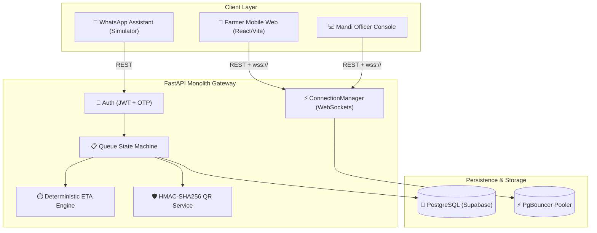

<div align="center">


# 🌾 KisanQueue
### *Real-Time Mandi Visibility, Queue Admission & DBT Payout Verification Layer*

[](https://smartindiahackathon.gov.in/)
[](https://fastapi.tiangolo.com)
[](https://vitejs.dev)
[](backend/tests/)
[](frontend/)
[](LICENSE)

<br/>

> **"e-Uparjan tells a farmer *that* they have a slot — KisanQueue tells them *whether today is actually a good day to travel*."**

[Live Demo](#-3-minute-demo-walkthrough) • [Key Features](#-key-features) • [Mathematical ETA Engine](#-deterministic-eta-engine) • [Architecture](#-system-architecture) • [Deployment](#-cloud-deployment-vercel--render) • [Quickstart](#-quick-start)

</div>

---

## 🎯 The Core Problem & Our Solution

Every harvest season, over **140 million Indian farmers** face grueling mandi bottlenecks:
- 🚨 **Blind 40km Journeys**: Farmers travel to procurement centres with zero warning of 6-hour truck lifting delays, broken weighbridges, or 30-tractor backlogs.
- 🚨 **Double-Booking & Queue Jumping**: Lack of cryptographic token verification creates chaos at APMC entry gates.
- 🚨 **Payment Uncertainty**: Complex grading deductions and manual entry errors delay Direct Benefit Transfer (DBT) payouts.

### The KisanQueue Advantage
1. **Zero Form Fatigue**: One-time phone OTP onboarding. Returning farmers generate passes in **under 15 seconds**.
2. **Deterministic, Explainable ETA Engine**: Mathematical queuing model that reacts live to operational status changes (e.g., FCI truck delays reduce throughput; ETAs jump instantly).
3. **Cryptographically Signed Offline QR Passes**: HMAC-SHA256 authenticated passes that work even when mandi cellular connectivity drops.
4. **2-Tap Officer Console**: APMC officers report conditions (Normal, Busy, Delayed, Paused) in 2 taps; all farmer screens update in **<2 seconds** via WebSockets.
5. **Accurate MSP DBT Payouts**: Automated calculation with statutory government minimum support prices.

---

## 🎨 Official Brand Design System

Built with a curated agritech palette engineered for high sunlight outdoor visibility and bilingual clarity:

| Swatch | Color Name | HEX Code | Purpose |
|---|---|---|---|
| 🌰 | **Almond** | `#D6BD98` | Warm wheat accent, highlight borders, pass badges, active button accents |
| 🍵 | **Matcha Brew** | `#677D6A` | Organic sage green, secondary buttons, status badges, subtle borders |
| 🌲 | **Forest Roast** | `#40534C` | Deep earthy slate green, card headers, secondary surfaces, active tabs |
| 🌑 | **Eclipse** | `#1A3636` | Rich obsidian forest canvas, primary brand anchor, dark mode surface |

---

## ✨ Key Features

```
┌─────────────────────────────────────────────────────────────────────────────┐
│                            KISANQUEUE ECOSYSTEM                             │
├──────────────────────────────┬──────────────────────────────┬───────────────┤
│ 🚜 Farmer Web & Mobile App   │ 🛡️ Mandi Officer Console    │ 💬 Assistant  │
├──────────────────────────────┼──────────────────────────────┼───────────────┤
│ • 1-Tap Pass Gen (KQ-1047)   │ • 2-Tap Capacity Engine      │ • Multi-turn  │
│ • Live Queue & ETA Sync      │ • QR & Token Gate Check-in   │   Onboarding  │
│ • Offline-Saved QR Passes    │ • Weighbridge & Grade Issue  │ • Live Mandi  │
│ • Full Hindi/English UI      │ • DBT Payout Verification    │   Status/ETA  │
│ • Self-Service Cancellation  │ • Zero IDOR / Opaque 404s    │ • Pass Cancel │
└──────────────────────────────┴──────────────────────────────┴───────────────┘
```

---

## 📐 Deterministic ETA Engine

KisanQueue rejects opaque "black-box" AI for a **deterministic, explainable, and legally defensible mathematical formula**:

$$\text{ETA (minutes)} = \left\lceil \frac{N \times T_{\text{base}}}{C \times F} \right\rceil$$

Where:
- $N$ = Live count of farmers waiting ahead in queue
- $T_{\text{base}}$ = Historical baseline processing time (e.g. 25 minutes per tractor)
- $C$ = Active operational weighbridge counters reported by mandi officer
- $F$ = Capacity factor ($1.00$ for Normal, $0.80$ for Busy, $0.60$ for Lifting Delayed, $0.00$ for Paused)

### Real-Time Delay Scenario:
- **Normal Operations**: $N = 14, T_{\text{base}} = 25, C = 2, F = 1.00 \implies \mathbf{\text{ETA} = 175\text{ min}}$ (~2h 55m, High confidence)
- **FCI Truck Delay Reported**: Officer taps *Lifting Delay* ($C = 1, F = 0.60$) $\implies \mathbf{\text{ETA} = 584\text{ min}}$ (~9h 44m, Low confidence)
- *All waiting farmers' screens update in < 2 seconds via WebSocket event push.*

---

## 🏗️ System Architecture



### Concurrency & Security Hardening
- **Anti-Double Booking**: `SELECT ... FOR UPDATE` row locking on centre records + PostgreSQL partial unique index `uq_queue_entry_active_per_farmer_centre`.
- **Anti-Tampering QR**: HMAC-SHA256 signature payload (`KQ:<base64-payload>.<signature>`) verified in constant time (`hmac.compare_digest`).
- **Financial Privacy**: Private payment events (`FARMER_PAYMENT_READY`) are dispatched exclusively to the farmer's direct connection, keeping public centre broadcasts strictly non-financial.

---

## 🚀 Quick Start

### Prerequisites
- **Node.js**: v18+
- **Python**: v3.11+
- **PostgreSQL**: (e.g., Supabase or local instance)

### 1. Backend Setup
```bash
cd backend
python -m venv venv

# Windows
venv\Scripts\activate
# macOS/Linux
source venv/bin/activate

# Install dependencies
pip install -r requirements.txt

# Generate cryptographically secure keys
python generate_secrets.py

# Create .env from template and paste your DATABASE_URL and generated secrets
cp .env.example .env

# Run database migrations & seed initial mandis/officers
alembic upgrade head
python seed.py

# Start FastAPI server
uvicorn main:app --reload --port 8000
```
> API runs at `http://localhost:8000` • Interactive Swagger Docs at `http://localhost:8000/docs`

### 2. Frontend Setup
```bash
cd frontend
npm install

# Start Vite development server
npm run dev
```
> App runs at `http://localhost:5173`

---

## 🧪 Testing & Verification

The repository includes a comprehensive 12-test suite covering math edge cases, WhatsApp dialog state machines, security guards, and end-to-end procurement lifecycles:

```bash
cd backend
pytest -v tests/
```

### Verified Test Suite
```
tests/test_eta.py::test_base_formula_example_1 PASSED
tests/test_eta.py::test_capacity_reduction_example_2 PASSED
tests/test_eta.py::test_zero_counters_or_paused PASSED
tests/test_eta.py::test_first_in_line PASSED
tests/test_eta.py::test_zero_in_line PASSED
tests/test_eta.py::test_freshness_degradation PASSED
tests/test_eta.py::test_anomalous_capacity_factor PASSED
tests/test_whatsapp.py::test_whatsapp_simulator_onboarding PASSED
tests/test_integration.py::test_auth_and_pass_generation_flow PASSED
tests/test_integration.py::test_officer_login_flow PASSED
tests/test_integration_e2e.py::test_full_procurement_lifecycle_and_payout_calculation PASSED
tests/test_integration_e2e.py::test_pass_cancellation_flow PASSED

======================= 12 passed in 14.33s =======================
```

---

## ☁️ Cloud Deployment (Vercel + Render)

### 1. Deploy Backend on [Render](https://render.com)
The repo contains a pre-configured [`render.yaml`](render.yaml) blueprint:
- **Build Command**: `pip install -r requirements.txt`
- **Start Command**: `uvicorn main:app --host 0.0.0.0 --port $PORT --workers 2`
- **Environment Variables**:
  - `DATABASE_URL`: `postgresql+psycopg://postgres:[PASSWORD]@[HOST]:6543/postgres`
  - `JWT_SECRET_KEY`: *(Generated via `generate_secrets.py`)*
  - `QR_HMAC_SECRET`: *(Generated via `generate_secrets.py`)*
  - `CORS_ORIGINS`: `http://localhost:5173,https://<your-vercel-app>.vercel.app`
  - `OTP_MOCK_ENABLED`: `true` (Enables evaluator quick OTP `1234`)

### 2. Deploy Frontend on [Vercel](https://vercel.com)
Pre-configured with [`frontend/vercel.json`](frontend/vercel.json) for client-side SPA routing:
- **Root Directory**: `frontend`
- **Framework Preset**: `Vite`
- **Build Command**: `npm run build`
- **Output Directory**: `dist`
- **Environment Variables**:
  - `VITE_API_BASE_URL`: `https://<your-render-backend>.onrender.com`

---

## 🎬 3-Minute Demo Walkthrough

| Step | Action | What to Observe |
|---|---|---|
| **1** | Farmer Login (`+919876543210` / `1234`) | Instant login as Ramesh Kumar (Biaora, Rajgarh). |
| **2** | Select Mandi & Quantity | Select *Rajgarh Centre*, choose *Wheat*, enter *40 Quintals* ➔ Pass **`KQ-1047`** issued with signed QR code. |
| **3** | Open Live Queue Tracker | Watch live queue position (`#1`), estimated wait time (`~25 min`), and operational status (*Normal*). |
| **4** | Officer Console (`officer_rajgarh` / `Demo@1234`) | Officer logs in in another window, taps **Lifting Delay** (60% capacity). |
| **5** | Real-Time Sync | Without refreshing, the farmer's screen immediately alerts **Lifting Delay** and ETA jumps to **~42 min**. |
| **6** | Gate Check-in & Completion | Officer scans token `47`, records actual weight, issues Grade A receipt with full **₹91,000 DBT Payout**. |

---

## 📁 Complete Documentation Suite

All 30 blueprint specifications are available in [`/docs`](docs/):

- [`01_PRD.md`](docs/01_PRD.md) — Product Requirements & Progressive Onboarding
- [`13_DATABASE_SCHEMA.md`](docs/13_DATABASE_SCHEMA.md) — PostgreSQL Schema & Indexes
- [`14_API_SPECIFICATION.md`](docs/14_API_SPECIFICATION.md) — REST & WebSocket Schema
- [`16_ETA_ENGINE.md`](docs/16_ETA_ENGINE.md) — Queuing Theory & Mathematical Proofs
- [`18_QR_TOKEN_SYSTEM.md`](docs/18_QR_TOKEN_SYSTEM.md) — HMAC Security & Threat Model
- [`27_DEMO_SCRIPT.md`](docs/27_DEMO_SCRIPT.md) — 7-Minute Jury Presentation Script

---

## 📄 License

Distributed under the **MIT License**. See [`LICENSE`](LICENSE) for details.

<div align="center">

Made with ❤️ for Indian Farmers • **Smart India Hackathon 2026**

</div>
