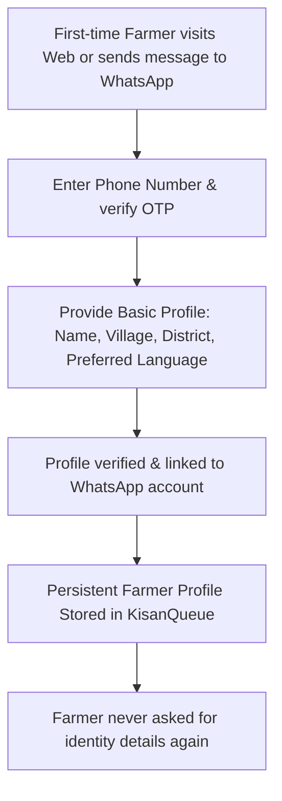
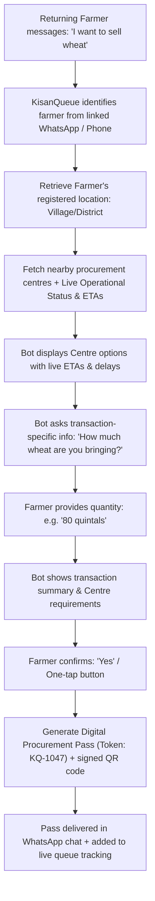
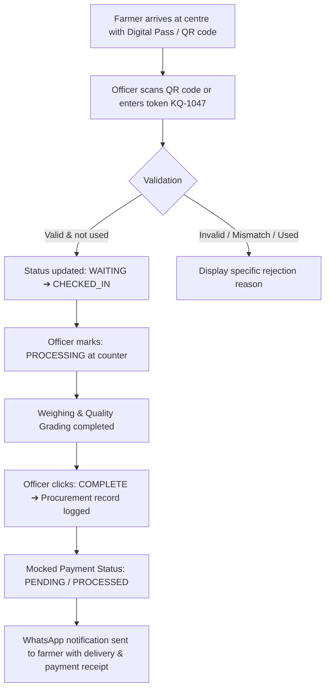
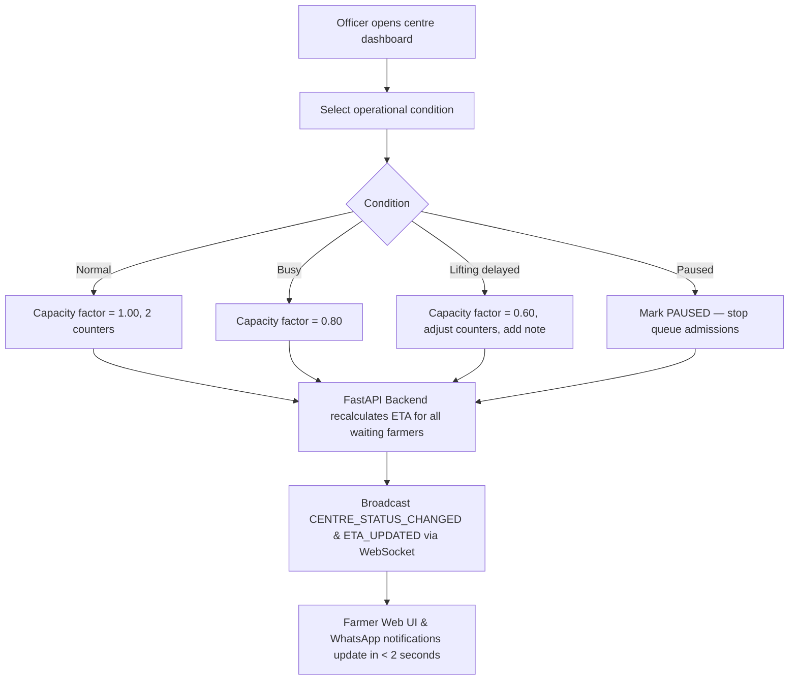
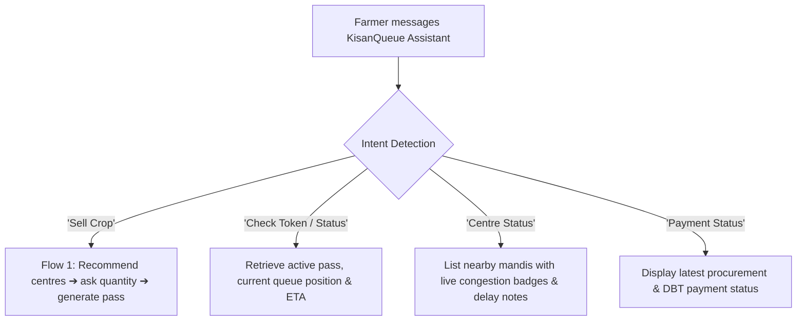
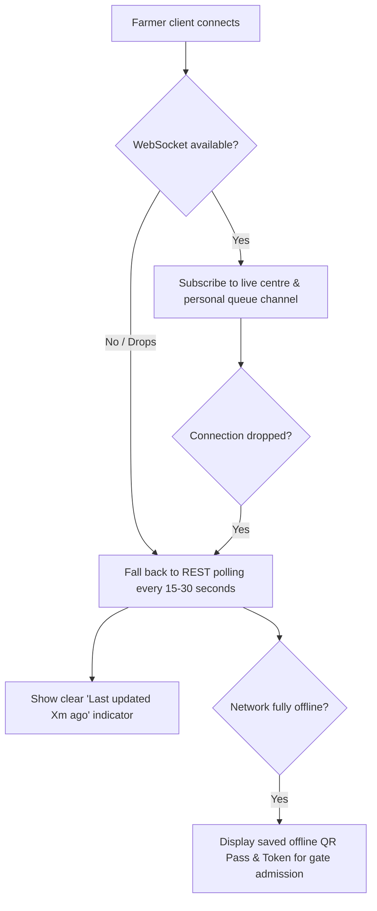

# 04 — User Flows

## Flow 0 — Farmer: One-Time Onboarding (Profile & WhatsApp Link)

---

## Flow 1 — Returning Farmer: Conversational Procurement & Pass Generation

---

## Flow 2 — Farmer & Officer: Gate Check-in to Procurement & Payment

---

## Flow 3 — Officer: 2-Tap Capacity & Delay Update

---

## Flow 4 — WhatsApp Persistent Assistant Interactions

---

## Flow 5 — Realtime Graceful Degradation

