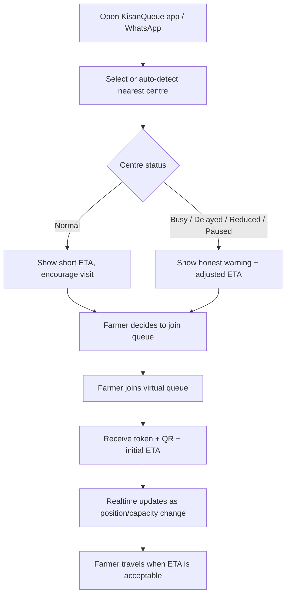
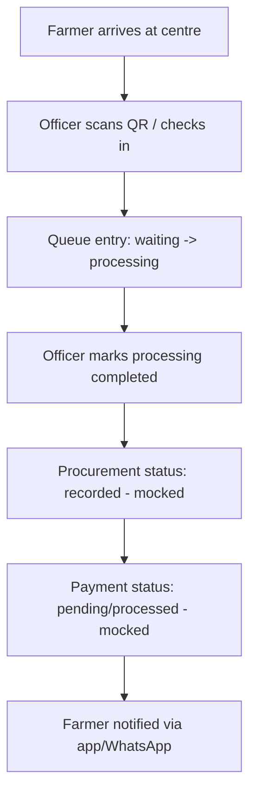
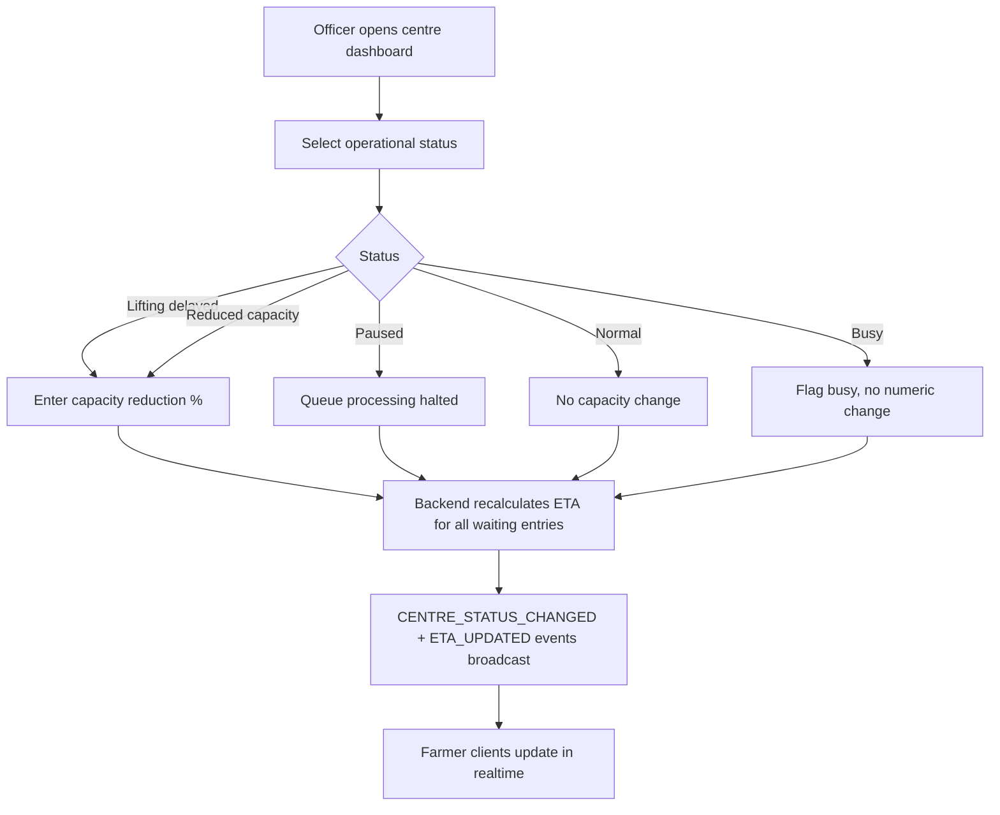
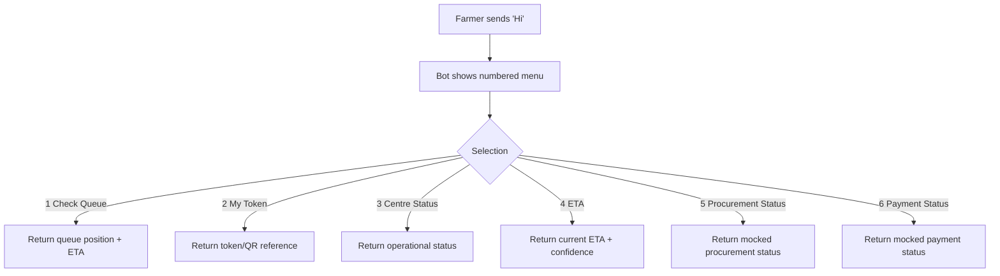
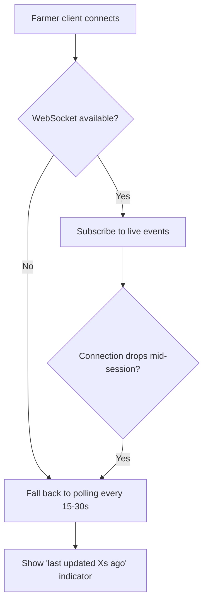

# 04 — User Flows

## Flow 1 — Farmer: Should I Go Today? (Core Value Flow)

## Flow 2 — Farmer: Queue to Payment

## Flow 3 — Officer: Operational Status Update

## Flow 4 — Farmer via WhatsApp (MVP Simulated)

## Flow 5 — Realtime Fallback (Graceful Degradation)

## Flow Notes
- Every flow that displays data must show a last-updated indicator where the data is not instantaneously fresh (Principle: Honest Information, `08_DESIGN_SYSTEM.md`).
- Officer flow (Flow 3) is intentionally the shortest flow in the entire product — this is a deliberate UX priority, not an oversight.
