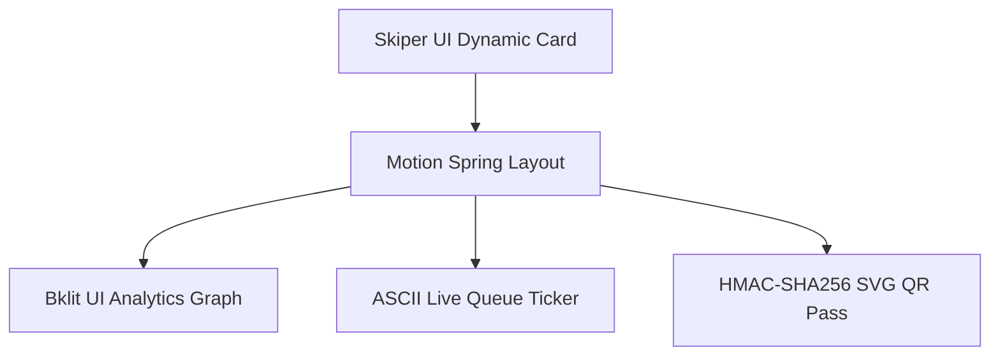

# 08 — Design System, Typography & Motion Engineering

> **Referenced Agent Skills & Libraries**: [`skiperui`](https://skiper-ui.com), [`motion`](https://motion.dev) (formerly Framer Motion), [`bklit-ui`](https://bklit.dev), [`ascii-magic`](https://ascii-magic.com) / [`asciinator`](https://asciinator.app), [`emil-design-eng`](../.agents/skills/emil-design-eng/SKILL.md), [`transitions-dev`](../.agents/skills/transitions-dev/SKILL.md), [`impeccable`](../.agents/skills/impeccable/SKILL.md), [`visual-design-foundations`](../.agents/skills/visual-design-foundations/SKILL.md), [`wcag-audit-patterns`](../.agents/skills/wcag-audit-patterns/SKILL.md).

---

## 1. Design Principles & Aesthetic Identity

* **Authentic Agricultural Grounding + State-of-the-Art Craft**: KisanQueue marries the rugged, hardworking reality of Indian grain mandis with ultra-modern software polish.
* **Component Craft Stack**:
  * **Skiper UI**: Modern, creative UI primitives, floating cards, animated buttons, and dynamic drawer dialogs.
  * **Motion (`motion/react`)**: Hardware-accelerated spring animations, layout morphing, exit transitions, and gestures.
  * **Bklit UI**: High-polish analytics, live mandi queue throughput charts, and capacity factor distribution graphs.
  * **ASCII Magic & Asciinator (`ascii-magic.com` / `asciinator.app`)**: Terminal-grade stylized ASCII art motion, animated wheat stalk brand icons, and live retro-modern queue matrix status tickers.
* **No Placeholders Principle**: 100% curated, high-fidelity real photographic and vector assets (e.g. `assets/images/hero_mandi.jpg`, `assets/images/assistant_avatar.jpg`) instead of generic placeholder grey boxes.

---

## 2. Bilingual Typography & Font Pairings

KisanQueue implements a curated, multi-font typographic hierarchy designed specifically for bilingual clarity across English and Hindi:

### 1. English Typography Stack
* **Primary Sans & Numerical Display**: `Urbanist` (Google Fonts)
  * Geometric, modern, highly legible at micro-sizes on sunlight-glare mobile screens. Used for queue numbers, ETAs, body text, buttons, and tables.
* **Rustic Display Accent**: `Rustic Roadway` (with fallbacks to `Cinzel Decorative`, `Rubik Dirt`, `Rye`)
  * Rugged, artisanal, authentic display accent representing agricultural grounding, highway transport, and mandi gate signage.

### 2. Hindi Typography Stack
* **Primary Hindi Display**: `AMS Shikha` / `Manoja` (with web-safe high-craft fallbacks: `Rozha One`, `Yatra One`, `Tiro Devanagari Hindi`, `Noto Sans Devanagari`)
  * Elegant, culturally authentic Devanagari letterforms with generous x-height and clear vowel diacritic spacing to prevent misreading by rural users.

```css
/* Typography Class Rules */
@import url('https://fonts.googleapis.com/css2?family=Urbanist:ital,wght@0,300..900;1,300..900&family=Rozha+One&family=Yatra+One&family=Noto+Sans+Devanagari:wght@400;500;600;700;800&display=swap');

:root {
  --font-en-sans: 'Urbanist', -apple-system, BlinkMacSystemFont, sans-serif;
  --font-en-rustic: 'Rustic Roadway', 'Rye', 'Rubik Dirt', serif;
  --font-hi-display: 'AMS Shikha', 'Manoja', 'Rozha One', 'Yatra One', serif;
  --font-hi-sans: 'Noto Sans Devanagari', 'Urbanist', sans-serif;
}

.font-rustic-accent {
  font-family: var(--font-en-rustic);
  letter-spacing: 0.04em;
}

.font-hindi-hero {
  font-family: var(--font-hi-display);
  letter-spacing: 0.01em;
}

.font-body {
  font-family: var(--font-en-sans);
}
```

---

## 3. Color System & High-Contrast Tokens

Exceeds WCAG 2.1 AA standards (minimum 4.5:1 text contrast, 3:1 graphical element contrast):

```css
:root {
  /* Brand / Agricultural Trust (Earthy Forest & Golden Wheat) */
  --color-primary-900: #064e3b; /* Deep Forest Green */
  --color-primary-800: #065f46;
  --color-primary-700: #047857;
  --color-primary-600: #059669;
  --color-primary-100: #d1fae5;
  --color-primary-50:  #ecfdf5;

  --color-wheat-gold:  #d97706; /* Golden Harvest */
  --color-wheat-light: #fef3c7;
  --color-wheat-dark:  #92400e;

  /* Surfaces & Canvas */
  --color-bg-base:     #f8fafc; /* Anti-glare rural canvas */
  --color-surface-card:#ffffff;
  --color-surface-subtle: #f1f5f9;
  --color-text-main:   #0f172a; /* Slate 900 */
  --color-text-muted:  #475569; /* Slate 600 */
  --color-border:      #e2e8f0;

  /* Semantic Mandi Status (Icon + Text + Color) */
  --status-normal:     #16a34a; /* Green */
  --status-normal-bg:  #dcfce7;
  --status-busy:       #d97706; /* Amber */
  --status-busy-bg:    #fef3c7;
  --status-delayed:    #ea580c; /* Orange */
  --status-delayed-bg: #ffedd5;
  --status-paused:     #dc2626; /* Crimson Red */
  --status-paused-bg:  #fee2e2;
  --status-stale:      #64748b; /* Slate Grey */
  --status-stale-bg:   #f1f5f9;
}
```

---

## 4. Motion Engineering & ASCII Canvas Effects

### 1. Motion Tokens (`transitions.dev` & `Motion`)
```css
:root {
  /* Durations */
  --duration-micro:      80ms;   /* Tap feedback, ripple */
  --duration-quick:      150ms;  /* Dropdown/modal close, text swap */
  --duration-fast:       250ms;  /* Dropdown/modal open, tabs sliding */
  --duration-medium:     350ms;  /* Card morph, toast dismiss */
  --duration-slow:       400ms;  /* Panel expansion, ASCII stream */

  /* Easing Curves */
  --ease-smooth-out:     cubic-bezier(0.22, 1, 0.36, 1); /* Natural friction */
  --ease-in-out:         cubic-bezier(0.77, 0, 0.175, 1); /* Morph */
  --ease-bounce:         cubic-bezier(0.34, 1.36, 0.64, 1); /* Token Pop */

  /* Scales */
  --scale-press:         0.97;   /* Responsive press feedback */
  --scale-enter:         0.95;   /* Elements enter from scale 0.95 (NEVER scale 0) */
  --blur-crossfade:      2px;
}
```

### 2. ASCII Motion & Terminal Effects (`ascii-magic` / `asciinator`)
* **Hero Mandi ASCII Live Canvas**: Real-time ASCII shader background representing live grain flow and mandi trucks at gate.
* **Animated ASCII Wheat Icon**:
```text
      \ | /
    -- (🌾) --   KISANQUEUE LIVE ADMISSION LAYER
      / | \      [STATUS: RAJGARH MANDI NORMAL - 14 FARMERS WAITING]
```
* **Matrix Live Queue Ticker**: Real-time streaming ASCII characters for queue position countdown transitions (`KQ-1047 ➔ IN_PROCESS`).

---

## 5. Visual Asset Catalog

| Asset Name | Target Path | Visual Description |
|---|---|---|
| **Mandi Hero Banner** | `assets/images/hero_mandi.jpg` | High-detail cinematic photo of modern Indian procurement centre at sunrise with tractor trolleys and digital weighbridge. |
| **Assistant Mascot Avatar** | `assets/images/assistant_avatar.jpg` | Warm, professional Indian agricultural advisor (*Krishi Mitra*) in traditional attire with modern digital advisor badge. |
| **Signed QR Pass Watermark** | `assets/images/wheat_grain_pattern.svg` | Subtle vector grain watermark embedded behind the dynamic QR pass for tactile authenticity. |

---

## 6. Component Inventory & Interaction Patterns



1. **Pass Card (`KQ-1047`)**: Built with **Skiper UI** floating container, Urbanist bold typography, pulsating live status beacon, and SVG QR matrix.
2. **Mandi Capacity Dashboard**: Built with **Bklit UI** charts for hourly throughput, counter active state, and lifting delay percentage.
3. **Interactive WhatsApp Simulator**: Realistic chat interface powered by **Motion** spring bubble animations and the **Krishi Mitra** avatar.
