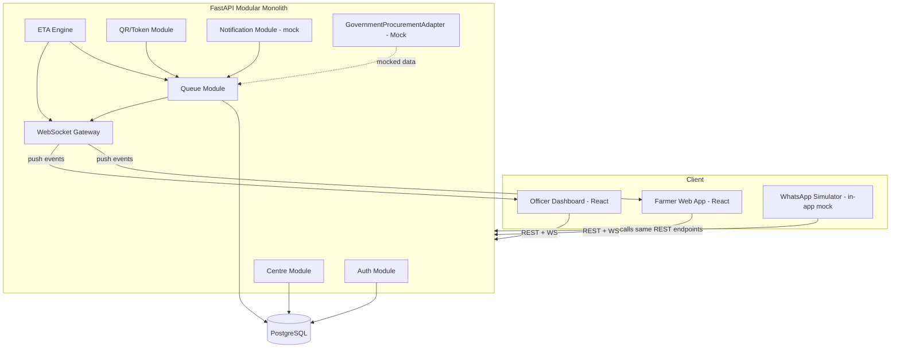
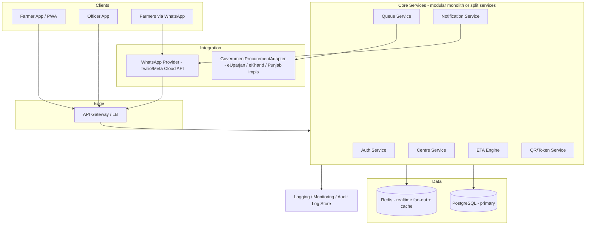

# 10 — System Architecture

## Modular Monolith vs Microservices — Explicit Evaluation
A queue system with an ETA engine has few, tightly coupled write paths (join queue, officer status update → recompute ETA → broadcast). Splitting this into separate services for a 7-hour build would introduce network calls, serialization overhead, and partial-failure handling for no MVP benefit. **Decision: single FastAPI modular monolith**, structured so the Queue, ETA, Notification, and Integration modules could later be extracted into services if genuine independent scaling needs arise (see `29_ROADMAP.md`).

## MVP Architecture

## Production Architecture (future — not built for MVP)

## Layer Responsibilities
- **Client layer**: farmer web app (mobile-first), officer dashboard, WhatsApp (mock in MVP, real provider in production).
- **API layer**: REST for CRUD/actions, WebSocket for live events.
- **Authentication**: JWT-based, role claims for Farmer/Officer/Admin.
- **Business logic**: Queue module (lifecycle), ETA engine (deterministic recompute), QR/token module (issue/validate), Notification module (dispatch, mocked channels for MVP).
- **Database**: PostgreSQL — single source of truth for queue, capacity, and token state.
- **Realtime event layer**: WebSocket gateway broadcasting `QUEUE_POSITION_CHANGED`, `ETA_UPDATED`, `CENTRE_STATUS_CHANGED` (full list in `15_REALTIME_QUEUE.md`).
- **Notification layer**: MVP mock logs a "would have sent" message; production wires to WhatsApp/SMS providers.
- **WhatsApp adapter**: provider-agnostic interface; MVP uses a mock provider.
- **Government integration adapter**: `GovernmentProcurementAdapter` interface; MVP uses a mock implementation returning simulated procurement/payment data (`21_INTEGRATION_STRATEGY.md`).
- **Logging/monitoring**: structured application logs for MVP; production adds an audit-log store and observability stack (`29_ROADMAP.md`).

## Key Design Decision Records
- **DR-1**: Deterministic ETA over ML — explainability and demo reliability outweigh marginal accuracy gains at this stage (`16_ETA_ENGINE.md`).
- **DR-2**: WebSockets over Socket.IO/SSE — smallest sufficient tool for a small, well-scoped event set.
- **DR-3**: Government integration is a pluggable adapter, never a direct dependency of core queue logic — protects the MVP from being blocked by unavailable external APIs, and is the technical backbone of the "layer, not a replacement" pitch.
