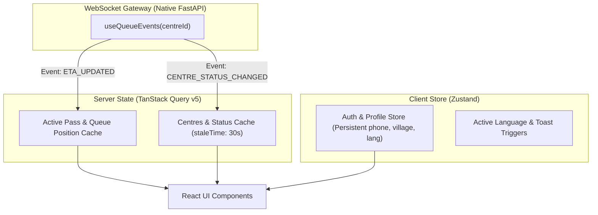

# 11 — Frontend Architecture & UI Engineering

> **Referenced Agent Skills**: [`transitions-dev`](../.agents/skills/transitions-dev/SKILL.md), [`emil-design-eng`](../.agents/skills/emil-design-eng/SKILL.md), [`ask-sonner`](../.agents/skills/ask-sonner/SKILL.md), [`react-state-management`](../.agents/skills/react-state-management/SKILL.md), [`zod-schema-validation`](../.agents/skills/zod-schema-validation/SKILL.md), [`zustand-state-management`](../.agents/skills/zustand-state-management/SKILL.md).

---

## 1. Core Stack
* **Framework**: React 18+ with TypeScript & Vite.
* **Styling**: Tailwind CSS v3.4+ augmented with CSS Motion Tokens (`_root.css`).
* **State Management**: TanStack Query v5 (server cache & auto-revalidation) + Zustand (persistent profile & UI state).
* **Routing**: React Router v6.
* **Localization**: `react-i18next` with bilingual dictionaries (`en.json`, `hi.json`).
* **Micro-Interactions**: Sonner (toasts), Lucide React (icons), transitions.dev CSS hooks.
* **Validation**: Zod + React Hook Form.

---

## 2. Folder Structure

```text
frontend/src/
├── app/
│   ├── App.tsx             # Root layout with Toaster & AsyncBoundary
│   ├── router.tsx          # Role-based route definitions
│   └── providers.tsx       # QueryClient, I18n, Zustand Persist, AuthProvider
├── components/             # Reusable UI Primitives (Design System)
│   ├── ui/                 # Button, Card, Badge, Modal, Input, Tabs, Toast
│   ├── motion/             # NumberPopIn, ShimmerText, StaggerGroup, ErrorShake
│   └── layout/             # TopNavbar, BottomTabBar, AsyncBoundary, StaleBanner
├── features/
│   ├── onboarding/         # One-time 3-step farmer setup wizard
│   ├── assistant/          # Persistent WhatsApp simulator & conversational UI
│   ├── centres/            # Mandi discovery, live congestion list, details
│   ├── pass/               # Pass generator, live queue tracker (KQ-xxxx), QR modal
│   ├── officer/            # Mandi console, 2-tap capacity updater, QR scanner
│   └── receipt/            # Post-procurement receipt & DBT payment tracker
├── hooks/
│   ├── useQueueEvents.ts   # WebSocket hook for live queue & ETA sync
│   ├── usePersistentUser.ts# Zustand hook for cached farmer identity
│   └── useNumberPopIn.ts   # Micro-interaction hook for updating ETA digits
├── lib/
│   ├── apiClient.ts        # Axios/Fetch wrapper with JWT injection & 401 handling
│   ├── wsClient.ts         # Resilient WebSocket client with exponential backoff
│   └── i18n/               # Hindi & English translation resources
├── styles/
│   ├── globals.css         # Base styles & Tailwind directives
│   └── motion-tokens.css   # transitions.dev semantic token scale
└── types/                  # Shared TypeScript interfaces
```

---

## 3. Application Routes & Navigation

```text
/                       ➔ Language selector & auto-redirect
/onboarding             ➔ One-time farmer profile setup (Name, Village, District)
/assistant              ➔ Persistent WhatsApp Farmer Assistant (Conversational UI)
/centres                ➔ Mandi discovery & live operational status
/pass/:tokenCode        ➔ Digital Pass Viewer (`KQ-1047`) + Live Queue Tracker + Signed QR
/receipt/:passId        ➔ Post-weighing receipt & DBT payment tracking
/officer/login          ➔ Mandi officer credential authentication
/officer/dashboard      ➔ Officer live table, QR scanner, and 2-tap capacity controller
```

---

## 4. State Management Architecture



---

## 5. UI Motion & Micro-Interaction Engineering

### 1. Number Pop-In for Live ETA Changes
When an officer updates centre capacity, the ETA recalculates and updates digits via a vertical blurred slide:
```tsx
// components/motion/NumberPopIn.tsx
export function NumberPopIn({ value, suffix }: { value: number | string; suffix?: string }) {
  return (
    <span className="t-number-pop inline-flex items-baseline font-bold" key={String(value)}>
      <span className="animate-number-in">{value}</span>
      {suffix && <span className="ml-1 text-sm font-normal text-slate-500">{suffix}</span>}
    </span>
  );
}
```

### 2. Error Shake on Invalid Inputs (`error-state-shake`)
For OTP validation errors or invalid quantity entries, the form applies a cubic-bezier shake without re-rendering form state:
```css
.is-shaking {
  animation: shake 320ms cubic-bezier(0.36, 0.07, 0.19, 0.97) both;
}
```

### 3. Hardware-Accelerated Transforms
To avoid main-thread frame drops under slow 3G network conditions, all animations leverage GPU layers (`transform: translateX()` and `opacity`) rather than layout-triggering properties (`width`, `height`, `left`).

---

## 6. Offline Support & Graceful Degradation
* **Pass QR Offline Cache**: The generated pass (`KQ-1047`) and its SVG QR payload are cached in persistent storage (`IndexedDB` / `localStorage`) upon generation.
* **WebSocket Fallback**: If the WebSocket drops, the client quietly switches to a 15-second REST polling loop while displaying an unobtrusive connection chip.
