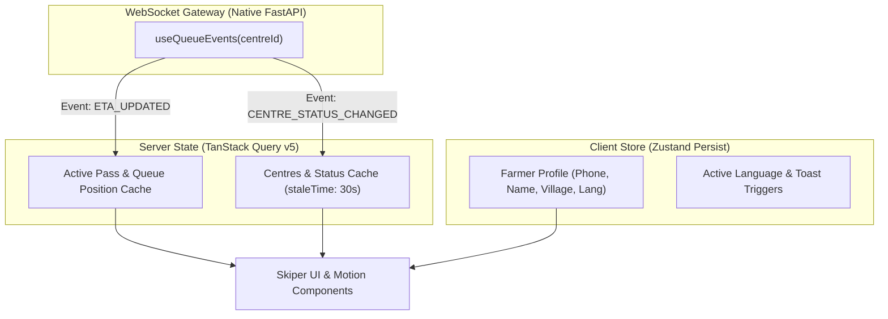

# 11 — Frontend Architecture & UI Engineering

> **Official Brand Palette**: **Almond** (`#D6BD98`) · **Matcha Brew** (`#677D6A`) · **Forest Roast** (`#40534C`) · **Eclipse** (`#1A3636`).  
> **Referenced Modern Libraries**: [`skiperui`](https://skiper-ui.com), [`motion`](https://motion.dev) (formerly Framer Motion), [`bklit-ui`](https://bklit.dev), [`ascii-magic`](https://ascii-magic.com) / [`asciinator`](https://asciinator.app), [`transitions-dev`](../.agents/skills/transitions-dev/SKILL.md), [`emil-design-eng`](../.agents/skills/emil-design-eng/SKILL.md), [`ask-sonner`](../.agents/skills/ask-sonner/SKILL.md).

---

## 1. Core Technology Stack
* **Framework**: React 18+ with TypeScript & Vite.
* **Component Primitives**: **Skiper UI** (creative floating dialogs, interactive cards, dynamic buttons) + Radix UI primitives.
* **Animation & Physics**: **Motion (`motion/react`)** + `transitions.dev` tokenized CSS classes.
* **Data Visualization & Analytics**: **Bklit UI** (mandi throughput graphs, capacity distribution charts).
* **Stylized ASCII Effects**: **ascii-magic / asciinator** (animated ASCII grain matrix & live queue ticker).
* **Typography**: English (`Urbanist` + `Rustic Roadway`) & Hindi (`AMS Shikha` / `Manoja` + `Noto Sans Devanagari`).
* **State & Cache**: TanStack Query v5 (server sync & auto-revalidation) + Zustand with `persist` middleware.
* **Routing**: React Router v6.
* **Notifications**: Sonner (`ask-sonner` imperative toast system) + Lucide Icons.

---

## 2. Tailwind Configuration (`tailwind.config.js`)

```javascript
/** @type {import('tailwindcss').Config} */
export default {
  content: ['./index.html', './src/**/*.{js,ts,jsx,tsx}'],
  darkMode: 'class',
  theme: {
    extend: {
      colors: {
        brand: {
          almond: '#D6BD98',
          matcha: '#677D6A',
          forest: '#40534C',
          eclipse: '#1A3636',
        },
        surface: {
          canvas: '#F9F8F5',
          card: '#FFFFFF',
          muted: '#EFECE6',
        }
      },
      fontFamily: {
        sans: ['Urbanist', 'Noto Sans Devanagari', 'sans-serif'],
        rustic: ['Rustic Roadway', 'Rye', 'Rubik Dirt', 'serif'],
        hindi: ['AMS Shikha', 'Manoja', 'Rozha One', 'Yatra One', 'serif'],
      },
    },
  },
  plugins: [],
};
```

---

## 3. Folder Structure

```text
frontend/
├── public/
│   ├── assets/
│   │   ├── images/
│   │   │   ├── hero_mandi.jpg          # Real cinematic mandi banner
│   │   │   └── assistant_avatar.jpg    # Krishi Mitra WhatsApp avatar
│   │   └── fonts/
│   │       └── RusticRoadway.woff2     # Rustic English display font
│   └── favicon.ico
├── src/
│   ├── app/
│   │   ├── App.tsx                     # Root layout with Toaster & ASCII background
│   │   ├── router.tsx                  # Role-based route definitions
│   │   └── providers.tsx               # QueryClient, I18n, Zustand Persist, AuthProvider
│   ├── components/                     # Reusable UI Primitives (Design System)
│   │   ├── ui/                         # Skiper UI buttons, cards, modals, tabs
│   │   ├── motion/                     # NumberPopIn, MotionDialog, ErrorShake
│   │   ├── charts/                     # Bklit UI Mandi Throughput & Capacity Charts
│   │   ├── ascii/                      # ASCIILiveTicker, ASCIIGrainFlowCanvas
│   │   └── layout/                     # TopNavbar, BottomTabBar, AsyncBoundary
│   ├── features/
│   │   ├── onboarding/                 # One-time 3-step farmer setup wizard
│   │   ├── assistant/                  # Persistent WhatsApp simulator (Motion bubbles)
│   │   ├── centres/                    # Mandi discovery, live congestion list
│   │   ├── pass/                       # Pass generator, live queue tracker (`KQ-1047`)
│   │   ├── officer/                    # Mandi console, Bklit throughput graphs
│   │   └── receipt/                    # Post-procurement receipt & DBT payment tracker
│   ├── hooks/
│   │   ├── useQueueEvents.ts           # WebSocket hook for live queue & ETA sync
│   │   ├── usePersistentUser.ts        # Zustand hook for cached farmer identity
│   │   └── useNumberPopIn.ts           # Micro-interaction hook for updating ETA digits
│   ├── lib/
│   │   ├── apiClient.ts                # Axios/Fetch wrapper with JWT injection
│   │   ├── wsClient.ts                 # Resilient WebSocket client with backoff
│   │   └── i18n/                       # Hindi & English translation resources
│   ├── styles/
│   │   ├── globals.css                 # Base styles & font-family tokens
│   │   └── motion-tokens.css           # transitions.dev semantic token scale
│   └── types/                          # Shared TypeScript interfaces
```

---

## 4. Motion & Component Integrations

### 1. Motion Spring Dialogs (Skiper UI + Motion)
```tsx
import { motion, AnimatePresence } from 'motion/react';

export function PassGenerationModal({ isOpen, onClose, onConfirm }: PassModalProps) {
  return (
    <AnimatePresence>
      {isOpen && (
        <div className="fixed inset-0 z-50 flex items-center justify-center bg-[#1A3636]/60 backdrop-blur-sm">
          <motion.div
            initial={{ opacity: 0, scale: 0.95, y: 16 }}
            animate={{ opacity: 1, scale: 1, y: 0 }}
            exit={{ opacity: 0, scale: 0.95, y: 16 }}
            transition={{ type: 'spring', stiffness: 350, damping: 28 }}
            className="w-full max-w-lg rounded-2xl bg-white p-6 shadow-2xl border border-[#D6BD98]"
          >
            <h2 className="font-['Urbanist'] font-bold text-2xl text-[#1A3636]">
              Confirm 1-Tap Pass
            </h2>
            {/* Modal Body */}
          </motion.div>
        </div>
      )}
    </AnimatePresence>
  );
}
```

### 2. Live Mandi Throughput Analytics (Bklit UI)
```tsx
import { AreaChart, MetricCard } from '@bklit/ui';

export function MandiThroughputAnalytics({ hourlyData, capacityFactor }: AnalyticsProps) {
  return (
    <div className="grid grid-cols-1 md:grid-cols-2 gap-4">
      <MetricCard
        title="Active Capacity"
        value={`${Math.round(capacityFactor * 100)}%`}
        status={capacityFactor >= 0.8 ? 'success' : 'warning'}
        trend="-40% (Lifting Delay)"
      />
      <AreaChart
        data={hourlyData}
        xKey="hour"
        yKey="quintals_processed"
        color="#40534C"
        fillColor="#D6BD98"
        title="Hourly Grain Throughput (Quintals)"
      />
    </div>
  );
}
```

### 3. ASCII Live Queue Matrix Ticker (`ascii-magic` / `asciinator`)
```tsx
export function ASCIILiveTicker({ centreName, waitingCount, etaMinutes }: TickerProps) {
  return (
    <div className="font-mono text-xs bg-[#1A3636] text-[#D6BD98] py-1.5 px-3 rounded-lg overflow-x-auto flex items-center gap-3 border border-[#40534C]">
      <span className="animate-pulse text-[#677D6A]">●</span>
      <span className="uppercase font-bold tracking-wider">
        [/// {centreName} ///] WAITING: {waitingCount} | LIVE ETA: ~{etaMinutes}M | ADMISSION: ACTIVE
      </span>
    </div>
  );
}
```

---

## 5. State Management Architecture


