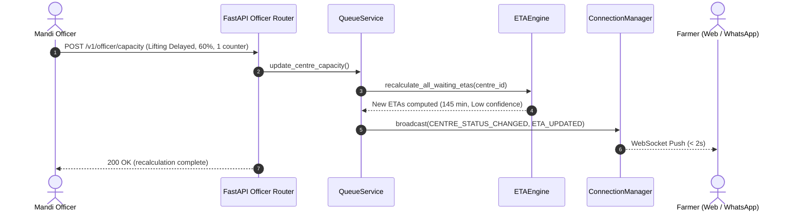

# 12 — Backend Architecture & Resilience

> **Referenced Agent Skills**: [`fastapi-templates`](../.agents/skills/fastapi-templates/SKILL.md), [`async-python-patterns`](../.agents/skills/async-python-patterns/SKILL.md), [`python-design-patterns`](../.agents/skills/python-design-patterns/SKILL.md), [`python-error-handling`](../.agents/skills/python-error-handling/SKILL.md), [`sql-optimization-patterns`](../.agents/skills/sql-optimization-patterns/SKILL.md).

---

## 1. Stack & Runtime
* **Runtime**: Python 3.11+ (CPython with `uvloop`).
* **Web Framework**: FastAPI 0.110+ (Async, modular monolith, OpenAPI 3.1 auto-generation).
* **ORM & Database Driver**: SQLAlchemy 2.0 (Async) + `asyncpg` with PostgreSQL.
* **Data Validation**: Pydantic v2 (`BaseModel`, `Field`, `ConfigDict(from_attributes=True)`).
* **Security & Tokens**: `python-jose` (HS256 JWT) + `passlib[bcrypt]` + `hmac/hashlib` (QR signing).
* **Realtime**: Native FastAPI WebSockets with async `ConnectionManager`.

---

## 2. Directory Structure

```text
backend/
├── main.py                      # App factory, lifespan context, CORS, error handlers
├── core/
│   ├── config.py                # Pydantic-settings with validation & defaults
│   ├── database.py              # Async SQLAlchemy engine + pool configuration
│   ├── security.py              # JWT signing, HMAC-SHA256 QR signer, password hashing
│   ├── dependencies.py          # FastAPI Depends() helpers (db_session, get_current_user)
│   ├── middleware.py            # CorrelationIdMiddleware, RequestLoggingMiddleware
│   └── exceptions.py            # Custom domain exceptions + standard JSON handlers
├── modules/
│   ├── auth/                    # One-time OTP generation & JWT issuance
│   ├── farmer/                  # Persistent farmer profile repository & service
│   ├── assistant/               # WhatsApp Persistent Assistant engine & intent parser
│   ├── centres/                 # Mandi master data & operational status queries
│   ├── queue/                   # Digital pass generation (`KQ-xxxx`) & queue lifecycle
│   ├── eta/                     # Deterministic ETAEngine formula implementation
│   ├── officer/                 # Mandi check-in scanner & 2-tap capacity updater
│   ├── qr/                      # Cryptographic QR token generator & validator
│   ├── procurement/             # Weighing record & DBT payment status services
│   └── integration/             # GovernmentProcurementAdapter interface + Mock adapter
├── realtime/
│   ├── gateway.py               # WebSocket route: /ws/{centre_id}
│   ├── manager.py               # Async ConnectionManager with heartbeat ping/pong
│   └── events.py                # Typed Event schemas (ETA_UPDATED, QUEUE_POSITION_CHANGED)
└── tests/                       # Unit & integration test suites (pytest + pytest-asyncio)
```

---

## 3. Core Engine Lifecycle & Async Patterns

### 1. Lifespan Context Manager
Database connection pool initialization and WebSocket cleanup are handled via FastAPI's `lifespan`:
```python
# main.py
@asynccontextmanager
async def lifespan(app: FastAPI):
    # Startup: warm up DB pool, verify connection
    await init_db_pool()
    yield
    # Shutdown: gracefully close open WebSocket connections and DB pool
    await close_db_pool()
```

### 2. Async Session Dependency
Ensures every request executes in a clean transaction with automatic rollback on unhandled exceptions:
```python
# core/dependencies.py
async def get_db_session() -> AsyncGenerator[AsyncSession, None]:
    async with async_session_factory() as session:
        try:
            yield session
            await session.commit()
        except Exception:
            await session.rollback()
            raise
```

---

## 4. Digital Pass & Real-Time Causal Chain

When an officer reports a delay or a farmer requests a pass, the system processes the request in-process within < 10ms:



---

## 5. Structured Logging & Observability

Every request is automatically assigned a unique `X-Request-ID` correlation token via middleware:
```json
{
  "timestamp": "2026-10-15T09:50:02Z",
  "level": "info",
  "request_id": "req-9a8b7c6d",
  "user_id": "usr-ramesh-102",
  "module": "officer",
  "action": "CAPACITY_UPDATED",
  "centre_id": "centre-rajgarh-01",
  "status": "LIFTING_DELAYED",
  "capacity_factor": 0.60,
  "duration_ms": 14.2
}
```

---

## 6. Resilience & Circuit Breaker Policies
* **Adapter Isolation**: All government mock or real adapter calls are wrapped with a 2.5s timeout. If a downstream government portal times out, KisanQueue falls back to cached data without crashing the queue engine.
* **Database Pool Sizing**: Configured with `pool_size=20`, `max_overflow=10`, `pool_timeout=10` to guarantee zero lock contention during peak morning rush hours.
