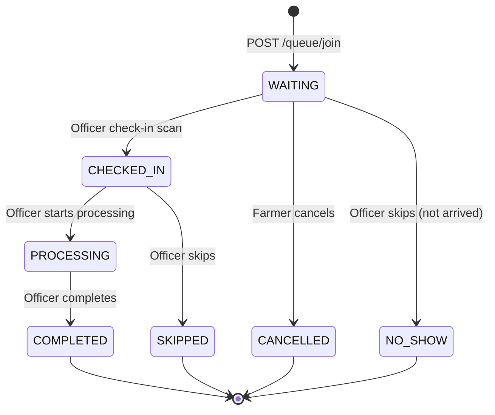

# 15 — Real-Time Queue

## Overview
The real-time layer is responsible for propagating queue state changes (position shifts, ETA updates, centre status changes) to connected farmer and officer clients within ~2 seconds of a backend event — without requiring a page refresh.

**Implementation**: Native FastAPI WebSocket routes (`websockets` via Starlette). No Socket.IO, no Supabase Realtime. One backend instance manages all connections (no Redis pub/sub needed at MVP/hackathon scale). Redis pub/sub is the documented path for horizontal scaling: `29_ROADMAP.md`.

---

## Queue Lifecycle

Each `queue_entries` row progresses through a defined state machine:



**State definitions**:

| State | Meaning |
|---|---|
| `WAITING` | In queue, has not arrived at centre yet (or arrived but not yet scanned) |
| `CHECKED_IN` | Physically present, QR scanned, waiting to be called to counter |
| `PROCESSING` | At counter, weighing/grading/data entry in progress |
| `COMPLETED` | Procurement completed; triggers procurement_record creation |
| `CANCELLED` | Farmer-initiated cancellation (only valid from WAITING) |
| `SKIPPED` | Officer skipped (farmer not present when called) |
| `NO_SHOW` | Farmer never arrived; officer marked as no-show |

---

## Events Reference

Every event is a JSON object broadcast over the WebSocket connection.

| Event | Triggered by | Broadcast to |
|---|---|---|
| `QUEUE_JOINED` | Farmer joins queue | Officer's centre channel |
| `QUEUE_POSITION_CHANGED` | Any entry ahead completes/is skipped/cancelled | Farmer's personal channel + centre channel |
| `ETA_UPDATED` | Capacity update OR queue position shift | Farmer's personal channel |
| `CENTRE_STATUS_CHANGED` | Officer capacity update | All farmers subscribed to centre |
| `PROCESSING_STARTED` | Officer marks start | Farmer personal channel |
| `PROCESSING_COMPLETED` | Officer marks complete | Farmer personal channel |
| `CAPACITY_UPDATED` | Officer submits capacity form | All connected clients for centre |
| `CENTRE_PAUSED` | Officer sets status = PAUSED | All connected clients for centre |
| `CENTRE_RESUMED` | Officer sets status from PAUSED → anything else | All connected clients for centre |
| `ENTRY_SKIPPED` | Officer skips an entry | Officer centre channel |
| `ENTRY_CANCELLED` | Farmer cancels | Officer centre channel |

### Event Payload Shapes

```json
// QUEUE_JOINED
{
  "event": "QUEUE_JOINED",
  "data": {
    "queue_entry_id": "uuid",
    "token_number": 47,
    "farmer_name": "Ramesh Kumar",
    "crop": "Wheat",
    "position": 14,
    "joined_at": "2026-10-15T09:05:00Z"
  }
}

// QUEUE_POSITION_CHANGED (sent to individual farmer)
{
  "event": "QUEUE_POSITION_CHANGED",
  "data": {
    "queue_entry_id": "uuid",
    "new_position": 9,
    "eta_minutes": 53,
    "confidence": "MEDIUM",
    "eta_computed_at": "2026-10-15T09:22:00Z"
  }
}

// ETA_UPDATED (sent to individual farmer after capacity change)
{
  "event": "ETA_UPDATED",
  "data": {
    "queue_entry_id": "uuid",
    "old_eta_minutes": 87,
    "new_eta_minutes": 145,
    "confidence": "LOW",
    "reason": "LIFTING_DELAYED",
    "computed_at": "2026-10-15T09:50:00Z"
  }
}

// CENTRE_STATUS_CHANGED (sent to all centre subscribers)
{
  "event": "CENTRE_STATUS_CHANGED",
  "data": {
    "centre_id": "uuid",
    "status": "LIFTING_DELAYED",
    "capacity_factor": 0.60,
    "active_counters": 1,
    "notes": "FCI truck delayed by ~2 hours",
    "effective_from": "2026-10-15T09:50:00Z"
  }
}

// PROCESSING_COMPLETED
{
  "event": "PROCESSING_COMPLETED",
  "data": {
    "queue_entry_id": "uuid",
    "token_number": 47,
    "procurement_record_id": "uuid",
    "completed_at": "2026-10-15T10:30:00Z"
  }
}
```

---

## WebSocket Architecture

### Connection Channels
Two logical channel types; both use the same WebSocket endpoint `/ws/{centre_id}?token=<JWT>`:

1. **Farmer personal channel** (`farmer:{user_id}`): receives events specific to this farmer's `queue_entry`.
2. **Centre broadcast channel** (`centre:{centre_id}`): receives events relevant to all participants at this centre (capacity changes, status changes).

A farmer connecting to `/ws/{centre_id}` is registered in both channels. An officer connecting registers only in the centre channel (they see all entries).

### ConnectionManager

```python
# Pseudocode — realtime/manager.py
class ConnectionManager:
    centre_connections: dict[str, set[WebSocket]]  # centre_id → WebSockets
    farmer_connections: dict[str, WebSocket]        # user_id → WebSocket

    async def connect(ws, centre_id, user_id):
        await ws.accept()
        centre_connections[centre_id].add(ws)
        farmer_connections[user_id] = ws
        await send_initial_snapshot(ws, centre_id, user_id)

    async def disconnect(ws, centre_id, user_id):
        centre_connections[centre_id].discard(ws)
        farmer_connections.pop(user_id, None)

    async def broadcast_to_centre(centre_id, event_dict):
        for ws in centre_connections[centre_id]:
            await ws.send_json(event_dict)

    async def send_to_farmer(user_id, event_dict):
        ws = farmer_connections.get(user_id)
        if ws:
            await ws.send_json(event_dict)
```

### Initial Snapshot on Connect
When a client connects, the server immediately sends:
```json
{
  "event": "CONNECTED",
  "data": {
    "centre_status": { ... },
    "my_entry": { "position": 9, "eta_minutes": 53, "status": "WAITING" }
  }
}
```
This eliminates a blank-state flash on first load.

---

## Fallback Behavior (No WebSocket)

When the WebSocket connection cannot be established or drops:

1. **Client detection**: `ws.onerror` or `ws.onclose` triggers the fallback path.
2. **Polling**: client switches to `GET /v1/queue/my-status` every **15 seconds**.
3. **Visual indicator**: UI shows a subtle "Live updates paused — refreshing every 15s" badge (not an alarming error).
4. **Reconnect attempts**: exponential backoff — 2s, 4s, 8s, 16s, 32s, then stay on polling.
5. **Recovery**: on successful reconnect, WebSocket resumes and polling stops.

```typescript
// Pseudocode — lib/ws.ts
const BACKOFF_DELAYS = [2000, 4000, 8000, 16000, 32000];

function connectWithBackoff(centreId: string, attempt = 0) {
  const ws = new WebSocket(`${WS_BASE}/ws/${centreId}?token=${getToken()}`);
  ws.onopen = () => { attempt = 0; stopPolling(); };
  ws.onclose = () => {
    startPollingFallback(centreId);
    const delay = BACKOFF_DELAYS[Math.min(attempt, BACKOFF_DELAYS.length - 1)];
    setTimeout(() => connectWithBackoff(centreId, attempt + 1), delay);
  };
  ws.onmessage = (e) => handleEvent(JSON.parse(e.data));
}
```

---

## ETA Recalculation Trigger Points

ETA is recomputed (and broadcast) whenever any of these events occur:

| Trigger | Scope of Recalculation |
|---|---|
| Farmer joins queue | All WAITING entries at centre (positions shift) |
| Entry moves to PROCESSING | All WAITING + CHECKED_IN entries ahead recalculate |
| Entry COMPLETED / SKIPPED / NO_SHOW | All entries behind shift position; ETA recalculates |
| Officer capacity update | All WAITING + CHECKED_IN entries at centre |
| Centre PAUSED | ETA becomes "Indefinite / Centre paused" — no numeric estimate |
| Centre RESUMED | Recalculate from current backlog |

Recalculation is synchronous within the request handler (in-process call to `ETAEngine.compute()`). The result is broadcast before the HTTP response is returned.

---

## Concurrency Considerations (MVP)

- MVP runs a single backend process (Render/Railway single dyno). No shared state race conditions from multiple processes.
- FastAPI's async event loop handles concurrent WebSocket connections safely with `asyncio` primitives.
- **Known MVP limitation**: if the backend restarts, all WebSocket connections drop and must reconnect (polling fallback handles this).
- **Production path**: add Redis pub/sub so multiple backend instances can all publish to the same channel. Documented in `29_ROADMAP.md`.

---

## Stale Data Handling

- Every ETA sent over WebSocket includes `computed_at` timestamp.
- If a farmer's client has not received any event for > 5 minutes, it shows a "Last updated X min ago" indicator and triggers a one-time REST poll to refresh.
- Centre status cards always show `last_updated_at`. If `data_freshness = VERY_STALE` (> 30 min), a yellow warning badge appears regardless of WebSocket state.
