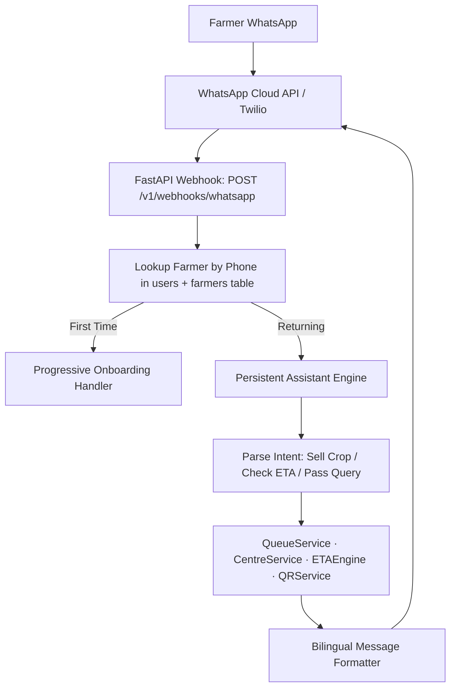

# 17 — WhatsApp Integration & Persistent Farmer Assistant

## Positioning & Core UX Principle

WhatsApp is not a bonus feature or a rigid form-filling chatbot. It is a **persistent farmer assistant** that:
1. **Collects profile and identity once** during one-time onboarding.
2. **Remembers the farmer's profile permanently** via their linked WhatsApp number.
3. **Never asks for information it already knows** (Name, village, district, language, Aadhaar hint).
4. **Asks only transaction-specific questions** (Crop, Quantity in quintals, Centre selection).
5. **Recommends suitable centres** based on the farmer's registered location and current live operational congestion/ETAs.
6. **Generates the digital procurement pass with a signed QR code** upon confirmation.

---

## 1. One-Time Onboarding & Account Linking Flow

```
Farmer: Hi / नमस्ते
Bot:    नमस्ते! 🌾 KisanQueue में आपका स्वागत है। 
        हम आपका किसान प्रोफ़ाइल केवल एक बार सेट करेंगे।
        कृपया अपना नाम बताएं:

Farmer: Ramesh Kumar
Bot:    धन्यवाद रमेश जी! आपका गाँव और जिला क्या है?

Farmer: Biaora, Rajgarh
Bot:    ✅ प्रोफ़ाइल सफलतापूर्वक सेट हो गई!
        नाम: Ramesh Kumar
        स्थान: Biaora, Rajgarh (MP)
        भाषा: हिंदी
        
        अब आप कभी भी फसल बेचने, कतार देखने या भुगतान जानने के लिए बस मुझे संदेश भेज सकते हैं!
```

---

## 2. Returning Farmer Procurement Flow (Subsequent Visits)

When an onboarded farmer messages the bot, KisanQueue identifies them immediately without re-asking personal details:

### Example in English:
```text
Farmer: I want to sell wheat.

Bot:    Sure, Ramesh! Based on your registered location (Biaora, Rajgarh), I found 3 nearby procurement centres:

        1️⃣ Rajgarh Centre — Estimated wait: 45 min (Normal ✅)
        2️⃣ Biaora Mandi — Estimated wait: 1h 20m (Busy ⚠️)
        3️⃣ Khilchipur Centre — Lifting delayed (Wait: ~3h 45m 🛑)

        Which centre would you prefer? (Reply 1, 2, or 3)

Farmer: 1

Bot:    Great choice. How much wheat (in quintals) are you bringing?

Farmer: 80 quintals.

Bot:    📋 Procurement Pass Summary:
        • Farmer: Ramesh Kumar
        • Centre: Rajgarh Procurement Centre
        • Crop: Wheat (80 quintals)
        • Est. Arrival Window: 11:00 AM – 11:30 AM
        • Est. Processing Wait: ~45 min (High confidence)
        • Gate Requirement: Clean grain (<12% moisture), Aadhaar last-4 (4521)

        Would you like me to generate your digital procurement pass?

Farmer: Yes

Bot:    ✅ Pass Generated Successfully!
        🎟️ Token: KQ-1047
        🏢 Centre: Rajgarh Procurement Centre
        ⏰ Est. Arrival: 11:30 AM
        ⏱️ Est. Wait Time: ~45 min
        
        📱 Digital QR Pass: https://kisanqueue.in/pass/KQ-1047
        [QR Code Image Attached]
        
        (Please show this QR code at the mandi gate for instant check-in. I will notify you if any delay occurs!)
```

### Example in Hindi:
```text
Farmer: मुझे गेहूं बेचना है।

Bot:    नमस्ते रमेश जी! आपके पंजीकृत क्षेत्र (ब्यावरा, राजगढ़) के अनुसार 3 नजदीकी केंद्र उपलब्ध हैं:

        1️⃣ राजगढ़ खरीदी केंद्र — अनुमानित प्रतीक्षा: ~45 मिनट (सामान्य ✅)
        2️⃣ ब्यावरा मंडी — अनुमानित प्रतीक्षा: ~1 घंटा 20 मिनट (व्यस्त ⚠️)
        3️⃣ खिलचीपुर केंद्र — उठान में देरी (अनुमानित: ~3 घंटे 45 मिनट 🛑)

        आप किस केंद्र पर जाना चाहते हैं? (1, 2 या 3 भेजें)

Farmer: 1

Bot:    राजगढ़ केंद्र चुना गया। आप कितना गेहूं (क्विंटल में) ला रहे हैं?

Farmer: 80 क्विंटल

Bot:    📋 पास विवरण सारांश:
        • किसान: रमेश कुमार
        • केंद्र: राजगढ़ खरीदी केंद्र
        • फसल: गेहूं (80 क्विंटल)
        • आगमन समय: 11:00 AM – 11:30 AM
        • अनुमानित प्रतीक्षा: ~45 मिनट

        क्या मैं आपका डिजिटल खरीद पास जनरेट करूँ?

Farmer: हाँ

Bot:    ✅ पास सफलतापूर्वक जारी किया गया!
        🎟️ टोकन नंबर: KQ-1047
        🏢 केंद्र: राजगढ़ खरीदी केंद्र
        ⏰ आगमन समय: 11:30 AM
        ⏱️ अनुमानित प्रतीक्षा: ~45 मिनट
        
        📱 डिजिटल QR पास लिंक: https://kisanqueue.in/pass/KQ-1047
        [QR कोड संलग्न]
        
        (गेट पर यह QR कोड दिखाएं। यदि केंद्र पर कोई देरी होगी, तो मैं आपको सूचित कर दूंगा!)
```

---

## 3. Quick Status & Query Commands

Returning farmers can also use quick numbered or text queries:

| Command | Assistant Action |
|---|---|
| `1` or `token` / `पास` | Shows active pass (`KQ-1047`), position in queue, and live ETA |
| `2` or `centres` / `केंद्र` | Lists nearby mandis with live operational badges & delay warnings |
| `3` or `eta` / `समय` | Detailed live wait time with confidence level and delay explanation |
| `4` or `receipt` / `खरीद` | Shows completed weighing, accepted quintals, and MSP payout summary |
| `5` or `payment` / `भुगतान` | Displays DBT payment status, reference number, and timeline |
| `cancel` / `रद्द` | Cancels active pass with 1 confirmation step |
| `help` / `मदद` | Lists available features and quick commands |

---

## 4. Outbound Real-Time Alerts (Proactive Push)

The assistant proactively alerts the farmer when conditions change:

```
[Officer at Rajgarh reports Lifting Delay]
Bot: ⚠️ ध्यान दें रमेश जी!
     राजगढ़ केंद्र पर FCI ट्रक में देरी के कारण उठान प्रभावित हुआ है।
     आपका नया अनुमानित समय: ~2 घंटे 15 मिनट (पहले ~45 मिनट था)।
     कृपया अपनी यात्रा उसी अनुसार तय करें।

[Farmer position drops to #2]
Bot: 🔔 टोकन KQ-1047: आपकी बारी आने वाली है!
     आप कतार में 2वें नंबर पर हैं। कृपया गेट/काउंटर पर तैयार रहें।

[Officer completes weighing]
Bot: 🎉 खरीद पूर्ण! 
     गेहूं: 78.5 क्विंटल | ग्रेड: A
     कुल राशि: ₹1,78,587.50
     भुगतान आपके बैंक खाते में 3-5 कार्य दिवसों में DBT द्वारा आ जाएगा।
```

---

## 5. Architecture & Adapter Pattern



### In-App WhatsApp Simulator (MVP)
The frontend (`src/features/whatsapp-sim/`) provides an authentic WhatsApp chat interface that interacts with this exact backend state, allowing seamless testing and SIH jury evaluation without physical device setup.

---

## 6. Provider-Agnostic Adapter Interface

```python
# modules/notifications/adapters/base.py
class WhatsAppAdapter(ABC):
    @abstractmethod
    async def send_message(self, to_phone: str, body: str) -> bool: ...

    @abstractmethod
    async def send_pass_with_qr(self, to_phone: str, pass_summary: str, qr_image_url: str) -> bool: ...
```

- **MVP**: `MockNotificationAdapter` logs message payloads to stdout and feeds the in-app simulator.
- **Production**: Seamless drop-in switch to `MetaWhatsAppCloudAPIAdapter` or `TwilioWhatsAppAdapter` via environment variable `WHATSAPP_PROVIDER`.
