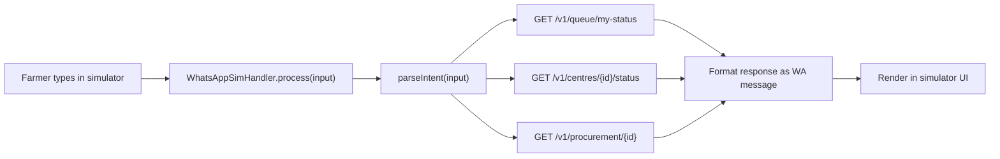
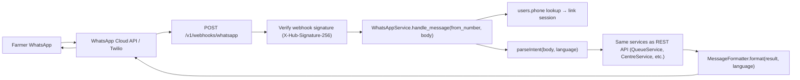

# 17 — WhatsApp Integration

## Positioning

WhatsApp is not a bonus feature. It is the **primary accessibility interface** for farmers who:
- Do not have a smartphone capable of running a web app reliably.
- Do not want to navigate a multi-screen application.
- Already use WhatsApp daily and are familiar with its interface.

**FACT**: WhatsApp has ~500 million users in India (ASSUMPTION: majority in rural/semi-urban areas — not independently verified with primary source). WhatsApp-based citizen services (COVID vaccination slots, ration card queries, government scheme updates) have been used extensively in India by state governments. **INFERENCE** — not citing a specific government service integration without verification.

**Classification of MVP approach**: `MVP MOCK` — The WhatsApp interaction is simulated inside the app UI using a chat-like component. No WhatsApp Business API account, no webhook, no phone number required during the hackathon. The production architecture is fully designed and can be activated with API credentials.

---

## Conversation Design

### Account Linking
A farmer must link their registered phone number before the WhatsApp bot can serve them. The link is established by:

1. Farmer sends any message to the KisanQueue WhatsApp number.
2. Bot replies with a link request: "Please send your registered phone number to link your KisanQueue account."
3. Farmer sends their phone number.
4. System looks up `users.phone` → if found, creates a WhatsApp-linked session (stored as a flag/token in the `users` table or a separate `whatsapp_sessions` table — **POST-MVP**).
5. Bot confirms: "Linked! Your account for Ramesh Kumar is now connected."

**MVP shortcut**: In the in-app simulator, account linking is pre-assumed (the logged-in user's account is automatically linked).

---

## Conversation Flow

```
Farmer: Hi
Bot: नमस्ते Ramesh Kumar! 🌾 KisanQueue में आपका स्वागत है।
     आप क्या जानना चाहते हैं?
     1️⃣ मेरा टोकन और स्थान
     2️⃣ केंद्र की स्थिति
     3️⃣ अनुमानित प्रतीक्षा समय (ETA)
     4️⃣ खरीद की स्थिति
     5️⃣ भुगतान की स्थिति
     0️⃣ मदद

Farmer: 1
Bot: आपका टोकन नंबर: 47
     स्थान: 9वें नंबर पर
     केंद्र: राजगढ़ खरीदी केंद्र
     स्थिति: प्रतीक्षा में
     अनुमानित प्रतीक्षा: ~53 मिनट (अनुमानित)
     अंतिम अपडेट: 9:22 AM

Farmer: 3
Bot: 📊 अनुमानित प्रतीक्षा समय
     आपकी स्थिति: 9वें नंबर पर
     अनुमानित समय: ~53 मिनट
     विश्वसनीयता: मध्यम
     ⚠️ यह एक अनुमान है। केंद्र की स्थिति बदलने पर समय बदल सकता है।

Farmer: 2
Bot: 🏢 राजगढ़ खरीदी केंद्र
     स्थिति: सामान्य ✅
     कतार में: 14 किसान
     सक्रिय काउंटर: 2
     अंतिम अपडेट: 9:32 AM (5 मिनट पहले)

Farmer: 4
Bot: 📋 खरीद की स्थिति
     टोकन: 47 — प्रक्रिया पूर्ण
     फसल: गेहूं | मात्रा: 38 क्विंटल
     ग्रेड: A | कुल राशि: ₹86,450
     (यह डेमो डेटा है — वास्तविक खरीद केंद्र प्रणाली से जुड़ने पर उपलब्ध होगा)

Farmer: 5
Bot: 💰 भुगतान की स्थिति
     राशि: ₹86,450
     स्थिति: प्रक्रिया में
     UTR: उपलब्ध नहीं
     अपेक्षित: 3–7 कार्य दिवस
     (यह डेमो डेटा है)
```

---

## Supported Commands

| Input | Action |
|---|---|
| `hi`, `hello`, `नमस्ते`, `helo` | Show main menu |
| `1` or `token` or `टोकन` | My token + position |
| `2` or `centre` or `केंद्र` | Centre status |
| `3` or `eta` or `समय` | ETA |
| `4` or `procurement` or `खरीद` | Procurement status |
| `5` or `payment` or `भुगतान` | Payment status |
| `0` or `help` or `मदद` | Help / command list |
| `cancel` or `रद्द` | Cancel queue entry (requires confirmation) |
| `language en` / `language hi` | Switch response language |

**Fuzzy matching**: The production bot should handle common misspellings and short forms. MVP simulator uses exact string matching.

---

## Outbound Notifications (Push Messages)

The bot also sends *proactive* messages to farmers without them asking:

| Trigger | Message |
|---|---|
| Queue joined | "टोकन 47 मिल गया। राजगढ़ केंद्र में 14वें नंबर पर हैं। अनुमानित: ~87 मिनट।" |
| ETA increased significantly (> +30 min) | "⚠️ केंद्र में देरी हो रही है। आपका नया अनुमान: ~145 मिनट। (उठान में देरी)" |
| You are next (position = 2) | "🔔 आप अगले हैं! कृपया काउंटर पर आएं।" |
| Processing started | "✅ आपकी फसल की प्रक्रिया शुरू हो गई है।" |
| Processing completed | "🎉 खरीद पूर्ण! गेहूं 38 क्विंटल, ₹86,450। भुगतान की जानकारी जल्द आएगी।" |
| Centre paused | "⏸️ राजगढ़ केंद्र अस्थायी रूप से बंद है। अपडेट के लिए प्रतीक्षा करें।" |

**MVP status**: All of these are logged as "would send" by `MockNotificationAdapter`. The message copy is finalized and wired to the real adapter in production.

---

## MVP Simulator Design

The in-app WhatsApp simulator is a React component (`features/whatsapp-sim/`) that:

1. Renders a chat UI styled to resemble WhatsApp (green header, chat bubbles, bottom input).
2. The farmer types a command in the input box.
3. The simulator calls the **same backend REST endpoints** that a real WhatsApp webhook would call.
4. The bot response is rendered as a chat bubble.
5. The farmer's account context is inherited from the current login session.

This means the simulator is a **real test** of the business logic — it is not a hardcoded script. If the ETA changes in the database, the WhatsApp simulator will return the updated value.



---

## Production Architecture



### Provider Selection
- **Recommended production provider**: Meta WhatsApp Cloud API (direct, no per-message cost beyond volume tiers).
- **Alternative**: Twilio Python SDK (`twilio` package) — easier to get started with sandbox, per-message cost.
- Both providers fit behind the same `WhatsAppAdapter` interface:

```python
# modules/notifications/adapters/base.py
class WhatsAppAdapter(ABC):
    @abstractmethod
    async def send_message(self, to_phone: str, body: str) -> bool: ...

    @abstractmethod
    async def send_template(self, to_phone: str, template_name: str, params: dict) -> bool: ...
```

---

## Webhook Security (Production)

- WhatsApp Cloud API signs each webhook with `X-Hub-Signature-256` (HMAC-SHA256 of body with app secret).
- Webhook handler validates signature before processing any message.
- Replay prevention: timestamp in webhook payload; reject if `> 5 minutes` old.
- Rate limiting: max 1 message/user/5s on the handler side.

---

## Message Templates (Production)

WhatsApp Business requires pre-approved templates for outbound (proactive) messages. Template IDs must be registered with Meta before production launch. MVP uses free-form messages in the simulator (no template approval needed).

Example templates to register:
- `kq_queue_joined` — token + position confirmation
- `kq_eta_updated` — delay warning
- `kq_processing_complete` — procurement done
- `kq_centre_paused` — centre closed alert

---

## Multilingual Handling

- Language preference stored on `users.preferred_language`.
- Bot always responds in the farmer's preferred language.
- Farmer can switch language mid-conversation with `language en` / `language hi`.
- All message templates have EN and HI variants.
- Architecture supports adding additional languages (Punjabi, Marathi, etc.) by adding translation keys — no structural change required.

---

## Error Handling in Bot

| Situation | Bot Response |
|---|---|
| Unrecognised input | "समझ नहीं आया। कृपया 0 टाइप करें सहायता के लिए।" |
| No active queue entry | "आपकी कोई सक्रिय कतार नहीं है। कतार में शामिल होने के लिए ऐप खोलें।" |
| Centre data stale | Response includes: "⚠️ डेटा 30 मिनट से अधिक पुराना हो सकता है।" |
| Backend error | "कुछ तकनीकी समस्या है। थोड़ी देर बाद कोशिश करें।" |
| Account not linked | "खाता लिंक नहीं है। कृपया अपना पंजीकृत फ़ोन नंबर भेजें।" |
