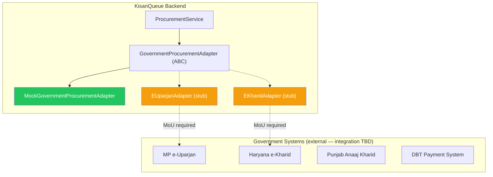

# 21 — Integration Strategy

## Core Principle
> **KisanQueue is a layer, not a replacement.**

KisanQueue does not need to replace e-Uparjan, e-Kharid, or Punjab's Anaaj Kharid systems. It adds the visibility layer that these systems do not currently provide to farmers before they travel. The integration architecture reflects this: KisanQueue can operate fully in stand-alone mode (with officer-reported data) and progressively integrate with government systems as data-sharing agreements become available.

---

## Existing Systems — Honest Assessment

**CLASSIFICATION: FACT where cited, INFERENCE/ASSUMPTION where speculative. No government APIs are claimed to exist unless a public source confirms them.**

### MP e-Uparjan
- **FACT**: Provides farmer registration, crop registration, slot booking, SMS notifications, and payment status for MSP procurement in Madhya Pradesh. ([mpeuparjan.nic.in](http://mpeuparjan.nic.in))
- **FACT**: Digitized the procurement workflow for wheat, paddy, and other crops.
- **ASSUMPTION (NOT VERIFIED)**: Has internal APIs or database interfaces that could theoretically be accessed via a data-sharing agreement. No public API documentation found.
- **Gap KisanQueue addresses**: e-Uparjan tells farmers *that* they have a slot — it does not expose live operational status (backlog, lifting delays, counter pauses) on any given day.

### Haryana e-Kharid
- **FACT**: Provides digital gate passes with QR codes, QR-based entry, and procurement workflow support for Haryana MSP procurement. ([ekharid.in](https://ekharid.in))
- **ASSUMPTION (NOT VERIFIED)**: Has internal data endpoints; no public REST API documented.
- **Gap KisanQueue addresses**: e-Kharid manages the procurement transaction — it does not provide real-time queue position or backlog-aware ETA to waiting farmers.

### Punjab Anaaj Kharid / e-Pass
- **FACT**: Punjab's system provides digital e-passes (with QR), congestion/rush information at procurement points via SMS, and farmer registration. ([anaajkharid.in](https://anaajkharid.in))
- **INFERENCE**: The "congestion information" feature is closest to KisanQueue's value proposition, but operates at the SMS notification level, not as a live, interactive, farmer-queryable interface.
- **Gap KisanQueue addresses**: Interactive, real-time query interface; officer-driven live status updates; capacity-aware ETA with confidence indicators.

### e-NAM
- **FACT**: National Agriculture Market — online trading platform for agricultural commodities at APMC mandis. Different from MSP procurement centres.
- **Relevance to KisanQueue**: Low for MVP. Future integration possibility for market price display alongside MSP information.

---

## The `GovernmentProcurementAdapter` Pattern

All potential integrations go through a single adapter interface. Core queue and ETA logic never imports a concrete government adapter — only the abstract base class. This enforces the "layer" architecture at the code level.

```python
# modules/integration/base.py

from abc import ABC, abstractmethod
from dataclasses import dataclass
from datetime import date
from uuid import UUID

@dataclass
class ProcurementRecord:
    farmer_id: str
    crop: str
    quantity_quintals: float
    grade: str | None
    msp_rate: float | None
    total_amount: float | None
    procurement_date: date
    source_system: str          # "EUPARJAN" | "EKHARID" | "ANAAJ_KHARID" | "MOCK"
    is_verified: bool

@dataclass
class PaymentStatus:
    status: str                 # "PENDING" | "PROCESSING" | "PAID" | "FAILED"
    amount: float | None
    utr_number: str | None
    paid_at: datetime | None
    source_system: str
    is_verified: bool

class GovernmentProcurementAdapter(ABC):

    @abstractmethod
    async def get_procurement_record(
        self,
        farmer_id: UUID,
        crop: str,
        procurement_date: date,
        centre_code: str
    ) -> ProcurementRecord | None: ...

    @abstractmethod
    async def get_payment_status(
        self,
        procurement_record_id: str
    ) -> PaymentStatus | None: ...

    @abstractmethod
    async def health_check(self) -> bool: ...
```

---

## MVP: `MockGovernmentProcurementAdapter`

```python
# modules/integration/mock_adapter.py

class MockGovernmentProcurementAdapter(GovernmentProcurementAdapter):
    """
    Returns seeded demo data from 22_MOCK_DATA.md.
    Used in all MVP/demo environments.
    is_verified = False on all returned records — UI shows "Demo Data" label.
    """

    async def get_procurement_record(self, farmer_id, crop, procurement_date, centre_code):
        # Returns hardcoded record for known demo farmer IDs
        return ProcurementRecord(
            farmer_id=str(farmer_id),
            crop="Wheat",
            quantity_quintals=38.0,
            grade="A",
            msp_rate=2275.00,
            total_amount=86450.00,
            procurement_date=procurement_date,
            source_system="MOCK",
            is_verified=False
        )

    async def get_payment_status(self, procurement_record_id):
        return PaymentStatus(
            status="PENDING",
            amount=86450.00,
            utr_number=None,
            paid_at=None,
            source_system="MOCK",
            is_verified=False
        )

    async def health_check(self):
        return True
```

---

## State-Specific Adapter Stubs

```python
# modules/integration/euparjan.py

class EUparjanAdapter(GovernmentProcurementAdapter):
    """
    STUB — Not implemented.

    Production implementation would require:
    1. A data-sharing MoU with MP State Government / NIC.
    2. Authentication credentials (OAuth2/API key — not publicly documented).
    3. Official API documentation (not publicly available as of August 2026 — ASSUMPTION).
    4. Network access to NIC internal endpoints (government VPN/whitelist may be required).

    Integration approach (PROPOSED — not verified):
    - Periodic sync: poll e-Uparjan farmer/procurement data every 15 minutes via
      a secure API or database replication agreement.
    - OR real-time webhook: e-Uparjan pushes procurement events to KisanQueue's
      GovernmentProcurementAdapter webhook endpoint.

    KisanQueue's responsibility: consume and display this data, not modify it.
    """

    async def get_procurement_record(self, *args, **kwargs):
        raise NotImplementedError("EUparjan integration requires official API agreement")
```

---

## Integration Architecture Diagram



Green = active in MVP. Amber = stub/future.

---

## Integration Roadmap

### Phase 1 — MVP (SIH Demo)
- `MockGovernmentProcurementAdapter` active.
- Procurement and payment data is seeded/simulated.
- UI shows "Demo Data" badge on all government-sourced fields.
- Architecture is fully demonstrated to judges — the adapter pattern makes clear how real integrations would plug in.

### Phase 2 — Pilot with a Willing State
- Negotiate a data-sharing pilot with one state's procurement department.
- KisanQueue connects as a read-only consumer of procurement data.
- No writing to government systems — KisanQueue never modifies MSP records.
- Implement the concrete adapter for that state.
- Test with a single centre, 1–2 officers, 10–20 farmers.

### Phase 3 — Multi-State Expansion
- Implement adapters for additional states as MoUs are signed.
- Each adapter is independently swappable via config.
- Consider a shared "IndianProcurementDataHub" adapter if a central national API is ever made available (this does not currently exist — **ASSUMPTION**).

---

## What KisanQueue Never Does with Government Data
- Never modifies MSP rates, crop grades, or payment amounts.
- Never stores farmer financial credentials or bank account details.
- Never bypasses government verification/grading processes.
- All government-sourced data is displayed read-only with source attribution.
- If government data and officer-reported status conflict, both are shown with provenance labels.

---

## The SIH Pitch Narrative for Integration

When judges ask *"How do you get the real data?"*:

> "In the MVP, officers manually report operational status via a one-tap dashboard — this is the data source for our ETA engine, and it requires no government API at all. For procurement and payment status, we've built a `GovernmentProcurementAdapter` interface that today runs on mock data, and tomorrow can be connected to e-Uparjan or e-Kharid by implementing their specific adapter — without changing a single line of core queue logic. This is how we integrate *with* existing systems rather than replacing them."
