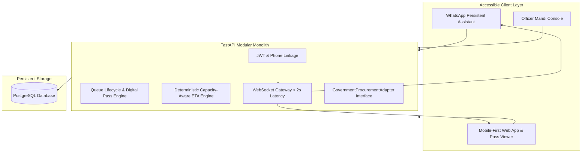

# 28 — SIH Pitch: Technical Story

## Problem Statement Context (PS 26032)

**PS 26032** (Smart India Hackathon 2026): *"Farmers often face long waiting times, lack of information regarding procurement schedules, and uncertainty about procurement status at government MSP procurement centres."*

This problem statement has three distinct real-world components:
1. **Long unexpected waiting times** — caused by backlogs, lifting delays, and reduced counter capacity that the farmer cannot anticipate before traveling.
2. **Lack of operational visibility** — farmer cannot see live centre conditions before leaving home.
3. **Severe form-fatigue & rigid interfaces** — existing portals force farmers through repetitive, multi-step forms on every single harvest visit.

---

## What Already Exists vs What KisanQueue Solves

| System | What It Does | What It Misses | How KisanQueue Solves It |
|---|---|---|---|
| **MP e-Uparjan** | Registration, slot booking, payment status | No live delay visibility or backlog status | Live capacity-aware ETA updated by mandi officers in real time |
| **Haryana e-Kharid** | Digital gate pass, QR check-in | No predictive wait times or dynamic queues | Real-time queue tracker with delay notifications |
| **Punjab Anaaj Kharid** | e-Passes, bulk SMS alerts | Rigid portal forms, broadcast-only alerts | Persistent WhatsApp Assistant with progressive, 1-tap pass generation |

---

## Key Innovations of KisanQueue

### 1. Progressive Onboarding & Persistent Assistant (UX Innovation)
* **One-Time Profile Setup**: Farmer links phone/WhatsApp number and enters basic location/profile once.
* **Zero Form-Fatigue**: Returning farmers never fill personal details again. A simple message (*"I want to sell wheat"*) triggers centre recommendations, asks only for quintals, and issues an instant pass.
* **Persistent Persona**: Acts as a trusted agricultural assistant on WhatsApp, not an interrogation chatbot.

### 2. Backlog-Aware Deterministic ETA (Algorithmic Innovation)
* Accounts for queue position ($N$), average processing rate ($T_{base}$), active counters ($C$), and officer-reported capacity factor ($F$):
$$\text{ETA (minutes)} = \left\lceil \frac{N \times T_{base}}{C \times F} \right\rceil$$
* Transparent, deterministic, and explainable — judges can see the causal relationship immediately without black-box ML.

### 3. Cryptographically Signed Digital Pass (Security & Offline Robustness)
* HMAC-SHA256 signed QR code with day-scoped TTL and single-use validation.
* Can be screenshotted and validated offline at the mandi gate even during total cell network blackout.

### 4. Pluggable Government Procurement Adapter (Architecture Innovation)
* Decouples KisanQueue from state-specific API differences.
* Runs on mock data for SIH MVP; easily connects to e-Uparjan / e-Kharid in production through clean adapter interfaces.

---

## High-Level Architecture for Judges

---

## One-Paragraph Judge-Ready Summary

> KisanQueue is a farmer-first visibility, queue, and admission layer for government crop procurement centres. It sits on top of existing systems like e-Uparjan and e-Kharid without replacing them. Through one-time onboarding, a persistent WhatsApp assistant, and a deterministic capacity-aware ETA formula, it eliminates form fatigue and tells the farmer what is actually happening at the mandi *before* they leave home. When a lifting delay happens, the officer reports it in 2 taps, and the farmer's ETA updates across Web and WhatsApp in 2 seconds. That is actionable, honest governance.
